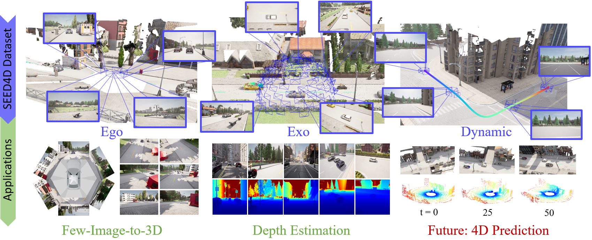

# SEED4D: A Synthetic Ego–Exo Dynamic 4D Driving 
Marius Kästingschäfer and Théo Gieruc and Sebastian Bernhard and Dylan Campbell and Eldar Insafutdinov and Eyvaz Najafli and Thomas Brox 



## [Project page](https://seed4d.github.io/) | [Paper](https://arxiv.org/abs/2412.00730) | [Data](coming_soon)

Models for egocentric 3D and 4D reconstruction, including few-shot interpolation and extrapolation settings, can benefit from having images from exocentric viewpoints as supervision signals. No existing dataset provides the necessary mixture of complex, dynamic, and multi-view data. To facilitate the development of 3D and 4D reconstruction methods in the autonomous driving context, we propose a Synthetic Ego--Exo Dynamic 4D (SEED4D) dataset. We here provide the code with which we generated the data.


Our data generator is build on [CARLA](https://github.com/carla-simulator/carla) and can generator synthetic egocentrical views similar to the camera setup in [nuScenes](https://www.nuscenes.org/nuscenes), [KITTI360](https://www.cvlibs.net/datasets/kitti-360/) or [Waymo](https://waymo.com/open/) and simultaneously create create exocentrical views. Resulting poses are outputted in a [Nerfstudio suitable data format](https://docs.nerf.studio/quickstart/data_conventions.html).


 ## Overview
- [Carla Sanity check](docs/carla_check.md)
- [Dataset creation](docs/datasets.md)
- [Dataset structure](docs/data_structure.md)
- [Dataset visualization](docs/visualizations.md)

## Acknowledgements 
We thank the creators of NeRFStudio, and the CARLA simulator for generously open-sourcing their code.

## License
Copyright (C) 2025 co-pace GmbH (subsidiary of Continental AG). All rights reserved. This repository is licensed under the BSD-3-Clause license. See [LICENSE](LICENSE) for the full license text.

## Citation
If you find this code useful, please reference in your paper:
```bibtex
@article{seed4d,
      title={SEED4D: A Synthetic Ego--Exo Dynamic 4D Data Generator, Driving Dataset and Benchmark}, 
      author={Marius Kästingschäfer and Théo Gieruc and Sebastian Bernhard and Dylan Campbell and Eldar Insafutdinov and Eyvaz Najafli and Thomas Brox},
      year={2024},
      archivePrefix={arXiv},
      url={https://arxiv.org/abs/2412.00730},
      journal={arXiv preprint},
      volume={arXiv:2412.00730},
}
```
