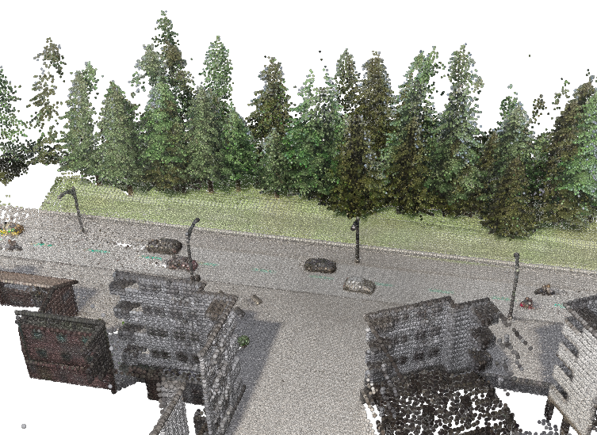
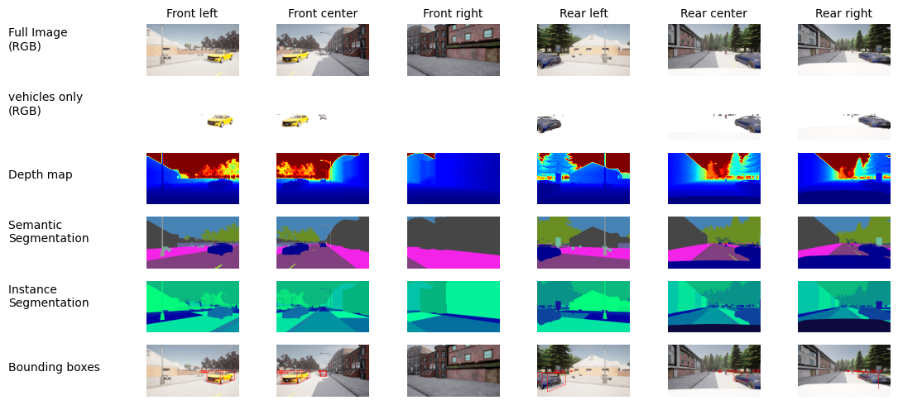
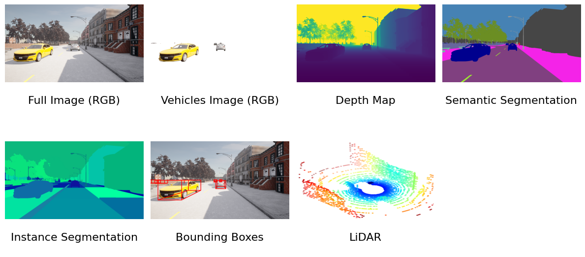
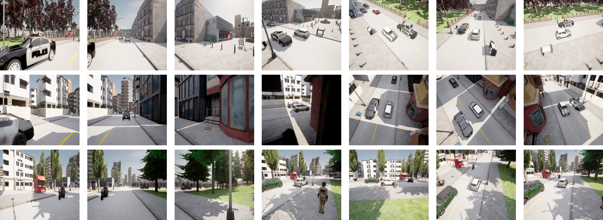
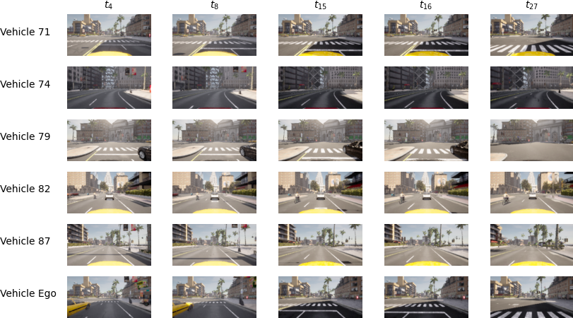

# Visualizations

Most visualizations from the paper are generated using the functions in the viz folder. 

## Point Cloud

Smaller values in the voxel-size result in fewer points. The VSCode extension Python PLY Preview is used to visualize the .ply file.


```
python3.8 viz/get_point_cloud.py --path /seed4d/data/static/Town01/ClearNoon/vehicle.mini.cooper_s/spawn_point_1/step_0 --voxel_size 0.6 --viewpoint nuscenes sphere
```



## Sensor Overview

Currently only implemented to visualize views from the ego vehicle.

```
python3.8 viz/vis_all_sensors.py --path /seed4d/data/static/Town02/ClearNoon/vehicle.mini.cooper_s/spawn_point_1/step_0/ --category static
```




## Ego-Exo Views

Showing front left, front and front right first and then a randomly sampled exo views.

```
python3.8 viz/vis_ego_exo_views.py --path /seed4d/data/static --towns 01 --spawnpoints 4 8 15
```



## Gif

```
python3.8 viz/vis_gifs.py --path /seed4d/data/dynamic/Town10HD/ClearNoon/vehicle.mini.cooper_s/spawn_point_4/step_0/ --vehicles 71
```


## Timesteps

```
python3.8 viz/vis_timesteps.py --path /seed4d/data/dynamic/Town10HD/ClearNoon/vehicle.mini.cooper_s/spawn_point_12
```

